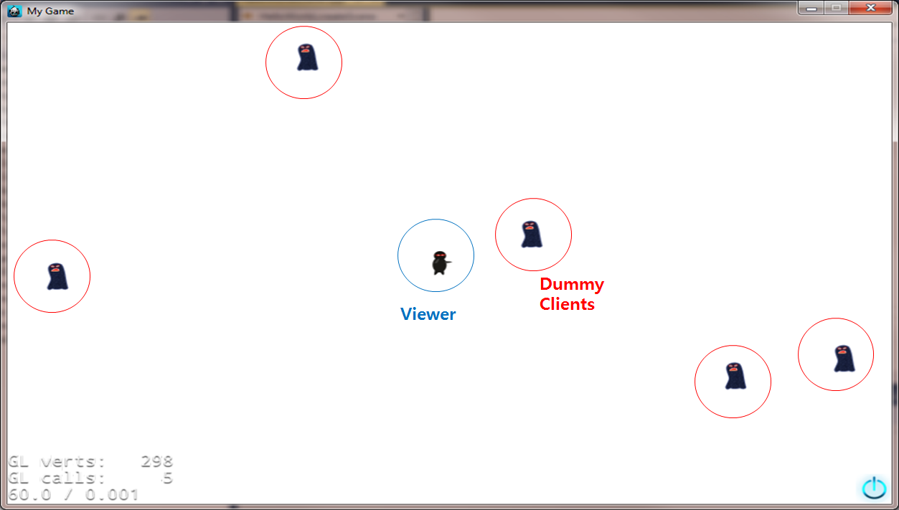

## Cocos2dxGameClient

A game client integrating with Cocos2D-x game engine and AWS C++ SDK.
This makes GameLift Client API calls to GameLift services and makes a TCP connection to GameLiftGameServer.

## How-to

 - Edit main.cpp file and then set your GameLift ALIAS_ID, GAMELIFT_REGION.
 - Build and Run.
 - Press 'L' to login to the GameLiftGameServer.
 
## ScreenShot
