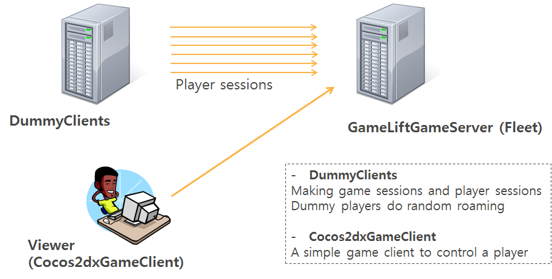

## Amazon GameLift?
[Amazon GameLift](https://aws.amazon.com/gamelift/) is a managed service for deploying, operating, and scaling session-based multiplayer games, reduces the time required to build a multiplayer backend from thousands of hours to just minutes. Available for developers using Amazon Lumberyard, Amazon GameLift is built on AWS’s highly available cloud infrastructure and allows you to quickly scale high-performance game servers up and down to meet player demand – without any additional engineering effort or upfront costs. 

## This repository? 
This repository consists of four projects: 
 - GameLiftGameServer
  - A stand-alone game server example utilizing GameLift. But, it has no dependency with Lumberyard as well as GridMate.
  - WIN64-based game server which listens a TCP port for clients and handles those requests
 - DummyClients
  - WIN64-based client application for testing GameLift and GameLiftGameServer
  - Creating multiple clients which make TCP session to GameLiftGameServer and communicate GameLift service in order to establish game sessions and player sessions by using AWS C++ SDK
  - Game client workload generator: this can be extended for a GameLift scaling/stress test or scenario-based client bot test
 - Cocos2dxGameClient
  - A game client which integrates with Cocos2D-x game engine and AWS C++ SDK
  - GameLift Client API calls to GameLift services and a TCP connection to GameLiftGameServer
 - GameLiftLinuxServer (coming soon!)
  - GameLiftGameServer Linux version

Overview:

## But, why?
I received many questions from game developers about GameLift. Major questions were like that:
 - Can we use other game engines such as Unreal3D and Unity3D with GameLift?
 - Can we leverage GameLift-alone with no dependency with Lumberyard?
 - How can we integrate our own game server to GameLift without GridMate?
 - Is there any other GameLift sample code using TCP protocol?
 - We’ve been confused between GameLift Client SDK in Lumberyard and GameLift Client APIs in AWS C++ SDK. It seems that the API documents in AWS web-site are auto-generated from the source code. Is there any easier or kind document?
 
As you can see, the facts of the matter are to study GameLift-alone features for their game and they want to know how to use GameLift SDK. So, I have started to make a sample program for better communication with game developers. The goal of this project is to show interactions among a game server, game clients and Gamelift. 

## How?
It is easy to build and run GameLiftGameServer and DummyClients. The only prerequisite is Visual Studio 2013.
 1. Open GameLiftGameServer solution file and then build it.
 2. Upload a GameLiftGameServer binary with affiliated files (dlls, logs in upload folder) by AWS CLI
 3. Create a GameLift Fleet by AWS Console (use a port number as Launch parameter)
 4. Open DummyClients solution file and edit DummyClients.h file in your context. (set ALIAS_ID, GAMELIFT_REGION, and MAX_GAME_SESSIONS)
 5. Build DummyClients and run. (AWS credential is required on your PC: environment variables or $HOME/.aws folder)
 6. For Cocos2dxGameClient, edit main.cpp file, set your ALIAS_ID, GAMELIFT_REGION, and then RUN! (you can login by pressing 'L' key.)

## And...
Some codes are written in a quick-and-dirty manner. But I plan to continuously improve these (if someone needs :)  
Please pull-requests!
